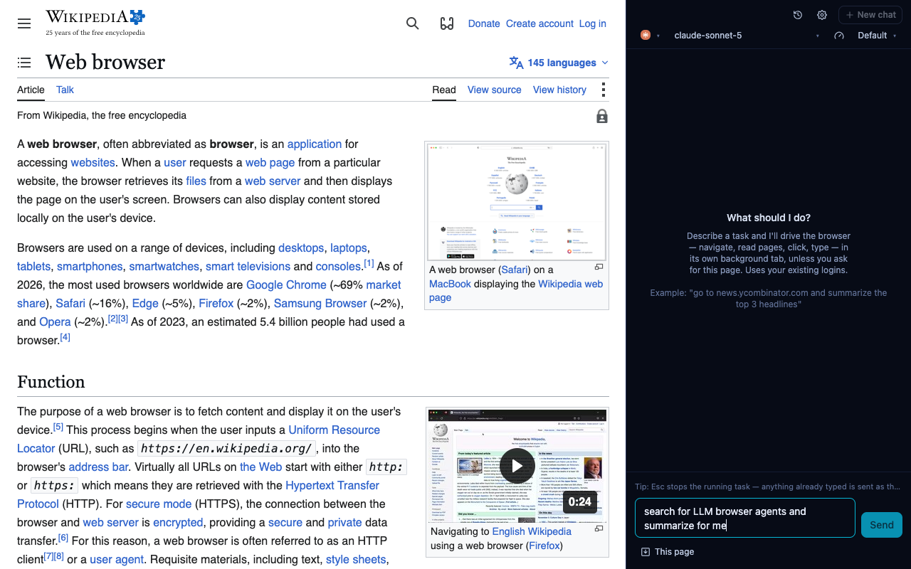
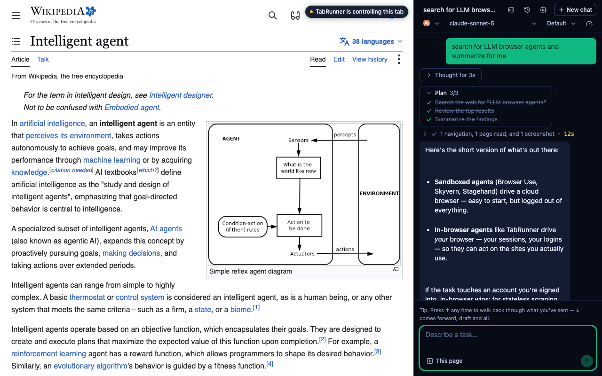
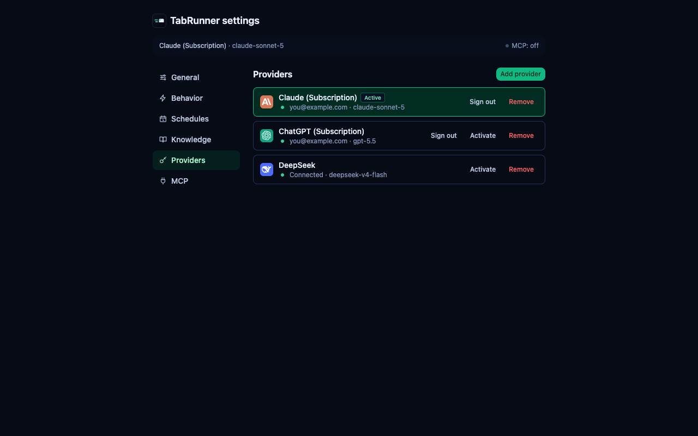
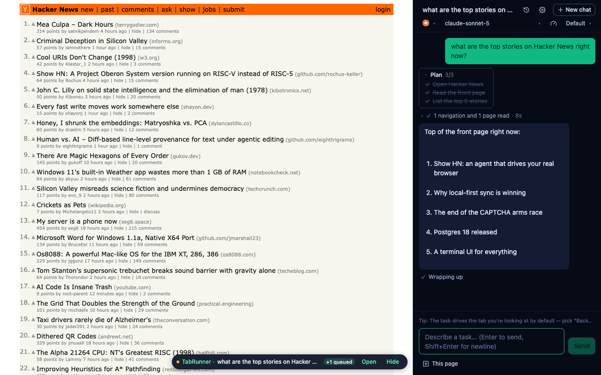

# TabRunner — Chrome Web Store listing

Source of truth for the store submission. Every block below is pasted verbatim into
`chrome.google.com/webstore/devconsole` → TabRunner. Sections are grouped the way the dashboard
groups them: **Store listing** (§1–§3) and **Privacy practices** (§4). When a feature lands, update
the matching block here first.

> ### Status — in review since 2026-08-10
>
> **v0.2.3 submitted.** Chrome Web Store review takes up to **two weeks**; the verdict arrives by
> email on the developer account. Nothing to do until then.
>
> Uploading a package or editing the listing while it is under review **restarts the clock** — so
> stage copy changes in this file and apply them to the dashboard only once it clears (or if a
> reviewer asks for one). See [§5](#5-when-review-returns).

---

## 1. Identity

| Field                | Value                                                                     |
| -------------------- | ------------------------------------------------------------------------- |
| **Name**             | TabRunner                                                                 |
| **Category**         | Productivity                                                              |
| **Default language** | English (listing localized: en / pt-BR / es)                              |
| **Visibility**       | Public                                                                    |
| **Homepage URL**     | https://tabrunner.app                                                     |
| **Support URL**      | https://github.com/gusnips/tabrunner/issues                               |
| **Privacy policy**   | https://tabrunner.app/privacy                                             |
| **Extension ID**     | `ilnohobdcigbmlikjbkdpbkhciephdle`                                        |
| **Store URL**        | https://chromewebstore.google.com/detail/ilnohobdcigbmlikjbkdpbkhciephdle |

**There is no short-description field.** The one-line summary the store shows in search results is
the manifest's `description`, which ships from `public/_locales/<lang>/messages.json` (`extDescription`).
Changing it means a new package upload — it cannot be edited from the dashboard.

| Locale | Shipped summary                                 |
| ------ | ----------------------------------------------- |
| en     | Provider-agnostic browser agent                 |
| pt-BR  | Agente de navegador independente de provedor    |
| es     | Agente de navegador independiente del proveedor |

<details>
<summary>Longer summaries, ready for the next version bump (cap is 132 chars)</summary>

The shipped strings are terse and jargon-forward. These read better in store search, and fit the
cap — swap them into `public/_locales/*/messages.json` whenever a version ships for another reason.

```
An AI agent that drives your real browser — your tabs, sessions and logins — through any provider you choose.
```

```
Um agente de IA que dirige seu navegador de verdade — abas, sessões e logins — com qualquer provedor que você escolher.
```

```
Un agente de IA que maneja tu navegador real — pestañas, sesiones y accesos — con el proveedor que elijas.
```

</details>

---

## 2. Full description

One per listing locale. CWS renders a Markdown subset — `##`/`###`, `**bold**`, `-` lists, links —
so these paste as-is.

<details open>
<summary><strong>English</strong> (default listing language)</summary>

```markdown
## You give the goal. It runs the tabs.

TabRunner is a browser agent that lives in your browser and works in it — not in a sandbox. It
works the tab you're already on, uses your logged-in sessions, and reads, clicks and types on the
sites you already use, until the task you described is done.

- **Works in your real browser** — your existing logins are its sessions. No setup on every site,
  no fake profile, no separate account.
- **Bring your own provider** — sign in with a subscription you already pay for (Anthropic,
  OpenAI, Kimi) or paste an API key, across 15 presets (Anthropic, OpenAI, Kimi, Z.ai, Qwen,
  DeepSeek, Gemini, OpenRouter, Groq, Mistral, xAI, Ollama) plus any endpoint speaking the OpenAI
  or Anthropic wire format. No vendor lock-in, no relay, no TabRunner server.
- **Your credentials stay yours** — a key or a sign-in goes straight from the extension to your
  provider. Nothing is stored outside Chrome. No account, no telemetry.
- **Trusted input** — clicks and keystrokes go through the Chrome DevTools Protocol, so they are
  genuine trusted events, not synthetic dispatches sites can ignore.
- **See the work** — a live plan, current action, token spend and elapsed time while the agent
  runs. Every step is logged in the conversation.

## How it works

1. Describe a task in the side panel — e.g. "open my inbox and summarize the last 3 emails".
2. Approve the plan it comes back with. TabRunner reads the page's accessibility tree and drives
   the tab: navigate, click, type, scroll, screenshot — as real user input.
3. Watch it work step by step, or send it to the background and get a notification when it's done.

## Private by design

- No TabRunner server exists. The extension speaks to your provider directly.
- Provider configs and conversation history live in `chrome.storage` on this device.
- The model never receives raw HTML — it works from a compact semantic tree of the page, and
  sensitive fields (passwords, one-time codes, card numbers) never leave the page.
- Works on Chrome, Brave, Edge, Arc, Opera and Vivaldi.

## Guardrails

- **You approve the plan** — TabRunner cannot click, type or navigate until you've okayed what it
  intends to do.
- **Ask before acting** — consequential actions (paying, sending, deleting) come back for your
  confirmation in the panel before they happen.
- **Stop is real** — Esc or the Stop button ends the run on the spot; anything you've already
  typed becomes the next task.
- **Reasoning effort** — pin `none` → `max` per task, or leave Auto and TabRunner runs the newest
  model your endpoint lists.

## Languages

English · Português (Brasil) · Español. Light and dark theme, or follow your OS.
```

</details>

<details>
<summary><strong>Português (Brasil)</strong></summary>

```markdown
## Você dá o objetivo. Ele cuida das abas.

O TabRunner é um agente que vive no seu navegador e trabalha dentro dele — não em um sandbox. Ele
usa a aba que você já está vendo, aproveita suas sessões logadas e lê, clica e digita nos sites que
você já usa, até concluir a tarefa que você descreveu.

- **Funciona no seu navegador de verdade** — seus logins atuais são as sessões dele. Sem configurar
  cada site, sem perfil falso, sem conta separada.
- **Traga o seu provedor** — entre com uma assinatura que você já paga (Anthropic, OpenAI, Kimi) ou
  cole uma chave de API, entre 15 presets (Anthropic, OpenAI, Kimi, Z.ai, Qwen, DeepSeek, Gemini,
  OpenRouter, Groq, Mistral, xAI, Ollama), além de qualquer endpoint que fale o formato OpenAI ou
  Anthropic. Sem lock-in, sem relay, sem servidor do TabRunner.
- **Suas credenciais continuam suas** — a chave ou o login vai direto da extensão para o seu
  provedor. Nada é guardado fora do Chrome. Sem conta, sem telemetria.
- **Entrada confiável** — cliques e teclas passam pelo Chrome DevTools Protocol, então são eventos
  confiáveis de verdade, não disparos sintéticos que os sites podem ignorar.
- **Veja o trabalho acontecer** — plano ao vivo, ação atual, tokens gastos e tempo decorrido
  enquanto o agente trabalha. Cada passo fica registrado na conversa.

## Como funciona

1. Descreva uma tarefa no painel lateral — por exemplo: "abra minha caixa de entrada e resuma os 3
   últimos e-mails".
2. Aprove o plano que ele propõe. O TabRunner lê a árvore de acessibilidade da página e conduz a
   aba: navegar, clicar, digitar, rolar, capturar tela — como entrada real do usuário.
3. Acompanhe passo a passo, ou mande a tarefa para segundo plano e receba uma notificação quando
   terminar.

## Privacidade por padrão

- Não existe servidor do TabRunner. A extensão fala direto com o seu provedor.
- Configurações de provedor e histórico de conversas ficam no `chrome.storage`, neste dispositivo.
- O modelo nunca recebe o HTML bruto — ele trabalha com uma árvore semântica compacta da página, e
  campos sensíveis (senhas, códigos de uso único, números de cartão) não saem da página.
- Funciona no Chrome, Brave, Edge, Arc, Opera e Vivaldi.

## Limites e controle

- **Você aprova o plano** — o TabRunner não clica, não digita e não navega antes de você aprovar o
  que ele pretende fazer.
- **Pergunta antes de agir** — ações com consequência (pagar, enviar, excluir) voltam para você
  confirmar no painel antes de acontecerem.
- **Parar é parar mesmo** — Esc ou o botão Parar encerra a execução na hora; o que você já tiver
  digitado vira a próxima tarefa.
- **Esforço de raciocínio** — fixe de `none` a `max` por tarefa, ou deixe em Auto e o TabRunner usa
  o modelo mais recente que o seu endpoint listar.

## Idiomas

English · Português (Brasil) · Español. Tema claro e escuro, ou seguindo o sistema.
```

</details>

<details>
<summary><strong>Español</strong></summary>

```markdown
## Tú das el objetivo. Él maneja las pestañas.

TabRunner es un agente que vive en tu navegador y trabaja dentro de él — no en un sandbox. Usa la
pestaña que ya tienes delante, aprovecha tus sesiones iniciadas y lee, hace clic y escribe en los
sitios que ya usas, hasta terminar la tarea que describiste.

- **Funciona en tu navegador real** — tus accesos actuales son sus sesiones. Sin configurar cada
  sitio, sin perfil falso, sin cuenta aparte.
- **Trae tu propio proveedor** — inicia sesión con una suscripción que ya pagas (Anthropic, OpenAI,
  Kimi) o pega una clave de API, entre 15 preajustes (Anthropic, OpenAI, Kimi, Z.ai, Qwen,
  DeepSeek, Gemini, OpenRouter, Groq, Mistral, xAI, Ollama), además de cualquier endpoint que hable
  el formato OpenAI o Anthropic. Sin dependencia de un proveedor, sin relay, sin servidor de
  TabRunner.
- **Tus credenciales siguen siendo tuyas** — la clave o el inicio de sesión va directo de la
  extensión a tu proveedor. Nada se guarda fuera de Chrome. Sin cuenta, sin telemetría.
- **Entrada confiable** — los clics y las teclas pasan por el Chrome DevTools Protocol, así que son
  eventos confiables de verdad, no disparos sintéticos que los sitios pueden ignorar.
- **Mira el trabajo** — plan en vivo, acción actual, tokens gastados y tiempo transcurrido mientras
  el agente trabaja. Cada paso queda registrado en la conversación.

## Cómo funciona

1. Describe una tarea en el panel lateral — por ejemplo: "abre mi bandeja de entrada y resume los
   últimos 3 correos".
2. Aprueba el plan que propone. TabRunner lee el árbol de accesibilidad de la página y conduce la
   pestaña: navegar, hacer clic, escribir, desplazar, capturar pantalla — como entrada real del
   usuario.
3. Míralo paso a paso, o envía la tarea al segundo plano y recibe una notificación cuando termine.

## Privado por diseño

- No existe ningún servidor de TabRunner. La extensión habla directamente con tu proveedor.
- La configuración del proveedor y el historial de conversaciones viven en `chrome.storage`, en
  este dispositivo.
- El modelo nunca recibe el HTML crudo — trabaja con un árbol semántico compacto de la página, y
  los campos sensibles (contraseñas, códigos de un solo uso, números de tarjeta) no salen de la
  página.
- Funciona en Chrome, Brave, Edge, Arc, Opera y Vivaldi.

## Límites y control

- **Tú apruebas el plan** — TabRunner no hace clic, no escribe ni navega antes de que apruebes lo
  que pretende hacer.
- **Pregunta antes de actuar** — las acciones con consecuencias (pagar, enviar, eliminar) vuelven a
  ti para confirmarlas en el panel antes de ocurrir.
- **Detener es detener** — Esc o el botón Detener termina la ejecución al instante; lo que ya hayas
  escrito se convierte en la siguiente tarea.
- **Esfuerzo de razonamiento** — fíjalo de `none` a `max` por tarea, o déjalo en Auto y TabRunner
  usa el modelo más reciente que liste tu endpoint.

## Idiomas

English · Português (Brasil) · Español. Tema claro y oscuro, o el del sistema.
```

</details>

---

## 3. Screenshots

Four **1280×800 PNGs**, uploaded in this order — the first is the card image.

| #   | Image                                                                                                                             | What it shows                                                                                                                                                                 |
| --- | --------------------------------------------------------------------------------------------------------------------------------- | ----------------------------------------------------------------------------------------------------------------------------------------------------------------------------- |
| 1   | [](screenshots/01-side-panel.png) | **Card image.** Wikipedia's "Web browser" article with the side panel beside it, pre-task: the task typed but not yet sent. The panel is the product, not a browser takeover. |
| 2   | [](screenshots/02-chat.png)             | A finished run: user bubble, plan card, tool trace, the agent's summary — with the "controlling this tab" badge on the page.                                                  |
| 3   | [](screenshots/03-providers.png)    | The options page's Providers tab: subscription rows (Anthropic, OpenAI) and an API-key row (DeepSeek), active provider highlighted.                                           |
| 4   | [](screenshots/04-chat-2.png)  | Hacker News with a second conversation and the floating status widget bottom-right (task · +1 queued · Open · Hide).                                                          |

Regenerate with `bun run build && bun run shots` — it rewrites all four in place and refreshes the
site's webp derivatives when `../site` is checked out. Rerun after any UI rebrand and eyeball them
before committing.

---

## 4. Privacy practices

The dashboard's **Privacy practices** tab: one textarea per permission, plus single purpose and the
policy URL.

### Single purpose

```
TabRunner lets an AI model the user chooses carry out tasks in their own browser: reading a page,
clicking, typing and filling forms on the sites they are already signed in to, until the task they
described is done. Data goes to exactly two places — the site being worked on, and the AI provider
the user configured with their own credentials. There is no TabRunner server, no account, no
analytics, and no third-party network activity.
```

### Privacy policy URL

```
https://tabrunner.app/privacy
```

The page is client-rendered, so the text appears once JS runs — fine for a reviewer opening it in a
browser. The JS-free mirror, if anyone ever needs one, is
[`PRIVACY.md`](https://github.com/gusnips/tabrunner/blob/main/PRIVACY.md) on GitHub; the site syncs
from it (`site/ bun run sync:legal`), so the two never drift.

### Permission justifications

Each is written for a reviewer with thirty seconds: what it does here, and why nothing narrower
works.

**`debugger`**

```
TabRunner clicks and types on the user's behalf. Chrome only produces trusted input events through
the DevTools Protocol; events dispatched from a content script are synthetic, and login forms,
payment fields and most modern web apps ignore them. TabRunner attaches to the single tab the
user's task is running in and detaches when the task ends. Chrome's "started debugging" banner
stays visible for the whole run, so the user always knows.
```

**`scripting`**

```
Injects the script that turns the current page into a compact accessibility tree (roles, names and
element references) for the AI model to read. This is what lets the model work without ever
receiving the page's raw HTML.
```

**`sidePanel`**

```
Hosts the extension's entire interface: the panel where the user writes a task, watches each step
as it happens, answers the agent's questions, and stops the run.
```

**`tabs`**

```
Reads the title and URL of the tab a task starts from, and switches to another open tab when the
task refers to one ("archive the email I was just reading"). Without it the agent cannot tell
which page it is working on, or return to a page the user already has open.
```

**`activeTab`**

```
Grants access to the tab the user submits a task from, at the moment they submit it.
```

**`tabGroups`**

```
A task the user sends to the background opens its own tab. TabRunner puts that tab in a labelled
tab group named after the task, so the user can see at a glance which tab the agent is working in
and close it in one action. Only groups TabRunner itself creates are touched.
```

**`storage`**

```
Stores the user's AI provider settings and their conversation history locally, in chrome.storage on
their own device. Nothing is uploaded — there is no TabRunner server.
```

**`notifications`**

```
Tasks run in their own background tab and keep working after the side panel closes. A
notification reports when a task finishes or fails, and when it pauses to ask the user a
question (for example, before sending something on their behalf). Fired only while the panel
is closed — never for runs the user stopped themselves.
```

**`alarms`**

```
TabRunner can optionally accept tasks from a local AI assistant on the user's own machine. Chrome
suspends the extension's service worker when idle, so a periodic alarm wakes it to re-establish
that local connection, and to keep the worker alive through a long task while the side panel is
closed. Alarms are only scheduled while the bridge feature is enabled or a task is in flight.
```

**`declarativeNetRequestWithHostAccess`**

```
Used only on TabRunner's own network requests to the AI provider the user configured — never on
pages the user visits or on the site being automated.

Providers that the user signs in to (rather than pasting an API key) reject requests that arrive
with a browser Origin header. TabRunner removes that header from its own calls so a subscription
sign-in works at all. The rule matches a fixed list of AI provider API hostnames, and modifies
only request headers on those hosts. It blocks nothing, redirects nothing, and reads no page.
```

**Host permissions (`<all_urls>`)**

```
The user decides which site the agent works on by typing a task in the side panel, so the set of
sites cannot be known in advance — it is whatever the user asks for, on the sites they are already
logged in to. The extension acts on a site only while a task is running on it. The only other
network destination is the AI provider the user configured.
```

---

## 5. When review returns

**Approved** — the listing goes live at the store URL in §1.

- Flip the site's download CTA from the unpacked zip to **Add to Chrome**: `LINKS.store` already
  exists in `site/src/lib/links.ts`, rendered as plain text until now.
- Update the install section of [`docs/website-brief.md`](website-brief.md) — its "until the store
  listing is approved" instructions stop being true the moment it lands.
- Store installs and the unpacked build share one extension ID (`manifest.key`), so a user with the
  website's zip must uninstall it before installing from the store; Chrome will not run both.

**Rejected** — the email names the policy clause. Fix, then `bun run release patch` and upload the
new `dist/tabrunner-<version>-store.zip` (never `-chrome.zip`; see
[AGENTS.md → Releasing](../AGENTS.md#releasing)). A rejection does not clear the listing text,
screenshots or privacy answers — they survive for the next submission.
